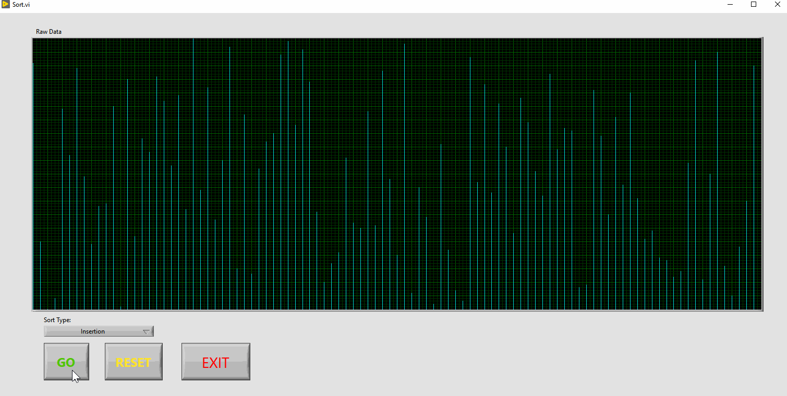
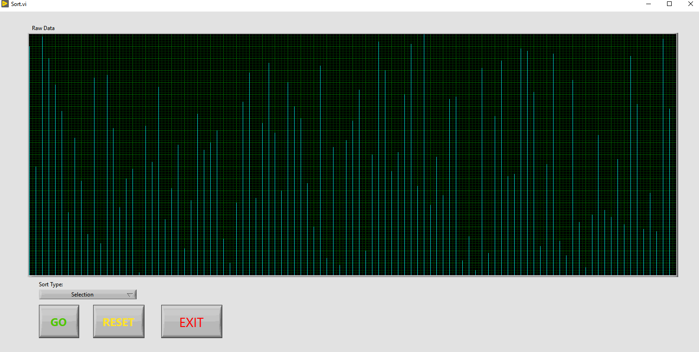
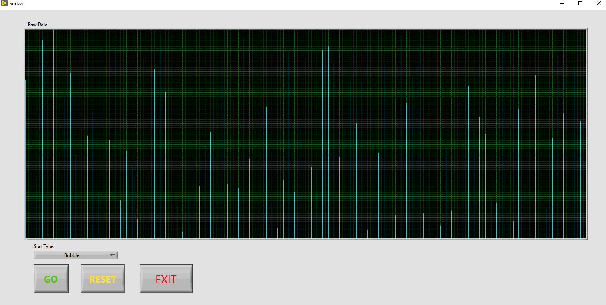

# LabView Visualized Sorting Algorithms
Some sorting algorithms visualized for a fun project to further my skill level with LabView.
The data set is a random asortment of non-recurring numbers from 1-100.

## Algotithms Used
### Insertion

### Selection

### Bubble

